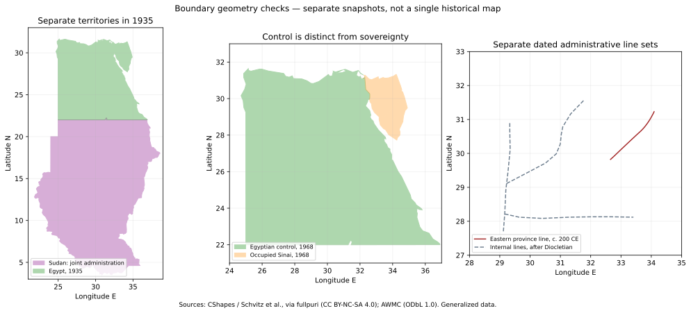

# مراجعة حدود أطلس مصر التاريخي

## نتيجة المراجعة

لا يمكن اعتماد المضلعات الحالية بوصفها حدوداً تاريخية دقيقة. يخلط الأطلس بين الحقبة الطويلة واللقطة الزمنية، وبين الإدارة المباشرة والتبعية والحملات والمحطات التجارية. كما أن الأرقام المساحية لا ترتبط بهندسة موثقة في سنة محددة. تصحيح الإحداثيات وحده لا يعالج هذا الخلط.

تغطي هذه المراجعة تشخيص الحقب الإحدى والعشرين، لكنها **لا تمثل إنجاز تحقيق مكاني كامل لها**. المسودة المصاحبة تضيف عرضاً صريحاً للنزاع وعدم اليقين، وتسع وعشرين لقطة لبداية الأسرات والدولة القديمة والدولة الوسطى والدولة الحديثة والعصر الصاوي والبطالمة والرومان والبيزنطيين والساسانيين والأيوبيين ومحمد علي ومصر في 1935 و1966 و1968 والمرجع المعاصر، ومرجعاً جغرافياً معاصراً لمصر مع حلايب وبئر طويل. بقية الرسومات القديمة محفوظة للمقارنة وموسومة بأنها غير محققة. لا ينبغي دمج هذه المسودة على أنها الإصلاح النهائي المطلوب.

التمييز بين هذه المستويات ضروري: يمكن توثيق تعاقب الحكام من دراسة تاريخية دون أن تقدم الدراسة حافة مضلع قابلة للرسم. ويمكن أخذ ساحل جزيرة من بيانات جغرافية معاصرة دون أن يثبت ذلك تاريخ خضوعها لحاكم معين. ولا يجوز استخدام مصدر عام لسد فجوة في ترسيم تفصيلي.

## أسباب الخلل في النسخة السابقة

تظهر رقعة البطالمة مثالاً واضحاً: يصل المضلع الرئيسي مصر بالشام ويغلق مساحات صحراوية بخطوط طويلة، بينما تظهر جزيرة قبرص كنقطة. ويتيح النموذج القديم مضلعاً أساسياً ومضلعاً ثانوياً فقط، مما يشجع على وصل الأقاليم المنفصلة أو إسقاطها من الرسم.

تعرف البيانات أنواعاً مثل `disputed_territory` و`uncertain_frontier`، لكن مكون الخريطة السابق لا يرسم `controlFeatures`. وبعض هذه السجلات وصف نصي فقط بلا إحداثيات. لذلك لا يكفي وضع اسم نزاع في السرد ليظهر على الخريطة؛ يجب وجود هندسة ذات مصدر أو الاكتفاء بإشارة نصية واضحة إذا لم تثبت الهندسة.

كانت المقارنة المعاصرة تعتمد رسماً يدوياً عنوانه «حدود رسمية» وربطاً غير صحيح بين تأكيد مواضع الحدود في طابا وتسوية جميع حدود مصر. الفصل في جزء من الحدود لا يثبت أجزاء أخرى. كذلك لا يصح تحويل اختلاف حدود 1899 والترتيبات الإدارية اللاحقة إلى خط واحد لا يوضح اختلاف المطالبات.[^12]

## معيار التصنيف والرسم

| المعنى | العرض | ما لا يعنيه |
|---|---|---|
| إدارة مباشرة أو قلب إقليمي | تعبئة خفيفة، وحافة منقطة إن كانت تقريبية | أن كل الصحراء المحيطة خضعت لإدارة متجانسة |
| تبعية أو نفوذ | أخضر متقطع | ضم كامل أو انعدام استقلال محلي |
| حكم مؤقت أو احتلال | برتقالي بشرطات ونقاط | اعتراف بنقل السيادة |
| مطالبات متعارضة أو جبهة نزاع | أحمر مهشر مع شرح الأطراف والزمن | إدارة مشتركة متساوية أو ترجيح قانوني لأحد الطرفين |
| ترسيم غير مؤكد | تنقيط مع بيان الدقة | نزاع سياسي بين دولتين بالضرورة |
| محطة أو حامية | نقطة مستقلة عند توثيق موضعها | سيادة على مساحة متصلة حولها |
| نفوذ بحري | طبقة منفصلة عن اليابسة | ملكية البحر أو مساحة أرضية |

درجة الثقة التاريخية ودرجة الثقة الهندسية متغيران مختلفان. ينبغي أن تتضمن النسخة النهائية لكل رقعة: التاريخ المرجعي، والسلطة، ونوع السيطرة، ومصدر الادعاء التاريخي، ومصدر الهندسة، وطريقة التحويل، وحدود الاستخدام. لا تُستخرج مساحة سيادية من نطاق تعليمي مرسوم باليد.

## تدقيق الحقب

| الحقبة | ملاحظة المراجعة | ما يلزم لاستكمال التحقيق |
|---|---|---|
| 1 — بداية الأسرات | التوحيد لا يثبت حدوداً صحراوية خطية. | فصل القلب المستقر عن البعثات؛ مصادر مواقع ومعالم. [1] |
| 2 — الدولة القديمة | التعدين والتجارة لا يثبتان ضماً دائماً لسيناء أو النوبة. | أدلة مؤرخة للحاميات والبعثات، دون ملء كل الفراغ بينها. [1] |
| 3 — الدولة الوسطى | شبكة حصون الأسرة 12 لا يجوز تعميمها على كامل الفترة. | مرحلة التوحيد ثم مرحلة الحصون؛ توثيق القطاع الجنوبي مستقلاً. [2] |
| 4 — الانتقال الثاني | طيبة والهكسوس وكوش مراكز متنافسة. | عدة رقع مع هامش عدم يقين للتماس. [2] |
| 5 — الدولة الحديثة | إدارة النوبة تختلف عن التبعية والحملات في الشام. | فصل توسعات الأسرة 18 عن الرعامسة والانحسار؛ ترسيم كل حالة. [2] |
| 6 — الأسرة 25 | وحدة الحكم والتدخل الآشوري تغيرا زمنياً. | لقطات قبل التدخل وبعده، دون امتداد موحد لكل الفترة. [3] |
| 7 — الصاوي | التقدم العسكري الخارجي ليس حداً دائماً. | فصل مصر عن مسارات الحملات. [3] |
| 8 — البطلمي | جزر وأقاليم منفصلة وحروب متعاقبة. | ثلاث لقطات تجريبية؛ الهندسة القديمة لا تزال توضيحية. [4] |
| 9 — الروماني والبيزنطي | الفترة تشمل تغيرات إدارية واحتلالاً ساسانياً. | تقسيم زمني والتحقق من تبعية سيناء والنوبة لكل مرحلة. [5،6] |
| 10 — صدر الإسلام | حدود الخلافة لا تساوي حدود ولاية مصر. | وثائق الولاية وتحقيق نص البقط قبل اعتماد حد معين. [6] |
| 11 — الطولوني | التاريخ السياسي أوضح من خط الثغور. | خرائط ودراسات مؤرخة للشام والجزيرة؛ لا اعتماد تلقائي للمضلع. [6] |
| 12 — العباسي الثاني | عودة الحكم لا تعني ضم مواقع الحملات المنافسة. | فصل جبهة الحرب من منطقة الإدارة. [6] |
| 13 — الإخشيدي | تفاصيل الشام والحجاز لا يحسمها مصدر تعاقب الحكام. | دراسة تفصيلية للعلاقة الإدارية وخطوط التماس. [6] |
| 14 — الفاطمي | جمع ممتلكات سابقة ولاحقة في لقطة واحدة يضلل. | فصل مراحل شمال إفريقيا عن الحكم من القاهرة والانحسار. [7] |
| 15 — الأيوبي | السيطرة على اليمن والشام لم تبدأ مع حكم مصر في اليوم نفسه. | مراحل توسع وتقاسم أسري، لا مضلع واحد دائم. [8] |
| 16 — المملوكي | حماية الحرمين والتبعية ليستا إدارة مماثلة لمصر والشام. | فصل أنواع العلاقة والامتدادات المؤقتة. [9] |
| 17 — العثماني | مصر ولاية داخل إمبراطورية أكبر. | تحديد تبعية القلاع والموانئ بدلاً من ضم كل طريق الحج. [10] |
| 18 — محمد علي | تسوية 1840–1841 تغير الامتداد جذرياً. | لقطة فرق الشام منفذة؛ السودان وكريت وأضنة والحجاز لم تُرقمن بعد. [11] |
| 19 — إسماعيل | المطالبات والمديريات والحملات لا تثبت سيطرة متصلة. | مصدر مكاني مناسب غير متاح في هذه المراجعة؛ لا اعتماد للرقعة. |
| 20 — الاحتلال والمعاهدات | حدود الإدارة المشتركة وتفسيرات الترسيم مختلفة. | مراحل مرتبطة بالوثائق، مع بيان الفروق بين 1899 وترتيبات لاحقة. [12] |
| 21 — الجمهورية | حدود السيطرة أثناء الحروب تختلف عن الحدود المرجعية. | لقطتا 1966 و1968 والمرجع المعاصر منفذة؛ مراحل 1973 والانسحاب وطابا غير منجزة. [12،13] |

المراجع العامة في الجدول تدعم النقد الزمني أو الإداري المحدد، ولا تدعم إحداثيات المضلعات القديمة. عدم وجود مصدر مكاني كافٍ نتيجة بحث يجب إظهارها، لا فرصة لاختراع خط أكثر نعومة.

هناك أيضاً فجوات بين بعض الحقب المعروضة. فالقائمة ليست تسلسلاً متصلاً لكل سنة منذ 3100 ق.م، وتغيب عنها فترات انتقال واحتلال بين تواريخ العناوين. يجب أن تصف الواجهة نفسها كحقب مختارة، وألا توحي بأن تمرير شريط السنوات يعيد بناء تاريخ سنوي كامل.

## اللقطات التجريبية

### الدولة الوسطى

فُصلت لقطة نحو 2000 ق.م عن نحو 1850 ق.م. الثانية تضيف سمنة الغربية كعلامة حصن موثقة الموضع، لا كخط سياسي ممتد عبر الصحراء. يستند تعاقب المراحل إلى المتحف المتروبوليتان، والموقع إلى المعجم المقارن للنوبة لسالفولدي وجيوس. لم تُفترض عاصمة واحدة لكامل المرحلتين. [2،14،15]

### الرومان والبيزنطيون

تعرض اللقطات سنوات تقريبية داخل فترات الحكم: 200 م و550 م و625 م و635 م. تتميز لقطة 625 م بالاحتلال الساساني، ثم يعود التصنيف البيزنطي في 635 م. الرقعة هي القلب المصري نفسه لأنها ليست إعادة بناء لحدود الولايات؛ تغيير السلطة لا يبرر اختراع اختلاف هندسي. [5،6]

### الأيوبيون

تفصل لقطة 1172 عن نحو 1190. تظهر في الأخيرة علامات تعريفية لليمن عند صنعاء وللشام عند دمشق، مع مصادر مواضع من اليونسكو. العلامات لا تمثل حدود الأقاليم، ولا تضم الصحراء بينها، ولا تحسم جبهة الصليبيين. تقاسم الأسرة بعد صلاح الدين يحتاج مراحل إضافية. [8،16،17]

### البطالمة

تفصل المسودة مصر عن قبرص وقورينائية وجبهة الشام. تعرض نحو 240 ق.م، ثم نحو 100 ق.م، ثم نحو 55 ق.م. اللقطة الوسطى سابقة لانتقال قورينائية إلى روما سنة 96 ق.م، والأخيرة لاحقة لضم قبرص سنة 58 ق.م. لا تعمم اللقطة الأخيرة على منح أنطونيوس المتأخرة أو إعادة ترتيب الممتلكات.[^4]

الرقعة المصرية الجديدة **قلب جغرافي للوادي والدلتا، وليست مضلعاً لكامل المملكة**. رسمها اليدوي معلن، ولا يجوز تفسير عرضها كعرض الأرض المأهولة الفعلي. أجزاء الصحراء والواحات والموانئ والحد الجنوبي لم تستكمل، كما لم تُرسم كل مراحل استقلال فروع الأسرة. شكل قبرص مأخوذ من طبقة اليابسة المعاصرة المعممة، وليس من مضلع الدولة المعاصرة الذي يستبعد أجزاء من الجزيرة بسبب التقسيم السياسي. لا يثبت هذا الساحل موضع الساحل القديم تفصيلياً.

### محمد علي

وثائق 1840–1841 تتيح بياناً أوضح للانسحاب من الشام. تفصل المسودة 1839 عن 1841 وتزيل رقعة الشام في الأخيرة. لا تستخدم أقصى وصول للحملة إلى الأناضول كحد إداري. هذه اللقطة ليست خريطة كاملة لكل ممتلكات محمد علي؛ السودان وكريت وأضنة والجزيرة العربية تحتاج رقمنة مستقلة.[^11]

## الحدود المعاصرة والنزاع

يُستخدم Natural Earth بوصفه مرجعاً معمماً يميل إلى تمثيل الإدارة الفعلية، لا بوصفه قراراً دولياً في السيادة. تُفصل رقعة حلايب وتهشر مع بيان الإدارة المصرية والمطالبة السودانية. أما بئر طويل فتصنف اختلافاً في الإسناد، لا مطالبة مزدوجة مماثلة لحلايب. لا تعتمد المسودة وصفاً قانونياً لها بأنها أرض متاحة للتملك.[^12][^13]

ذكر وادي حلفا يبقى نصياً لأن شكل النتوء لم يُرقمن في هذه الحزمة من مصدر مناسب. ولا يضاف مضلع تخميني لمجرد إكمال المظهر. كذلك لا تُرسم مناطق بحرية أو خطوط وقف نار تخمينية. تنبيه المصدر المؤرخ ظاهر في الواجهة؛ هذه الحزمة ليست خدمة تحديث لحظي للنزاعات.

بيانات مصر وقبرص من مقياس 1:50 مليون، وبيانات المناطق المختلف عليها من 1:10 مليون. كلاهما تعميم خرائطي، لا دقة ميدانية على مستوى القرية. يحتفظ ملف `geography-provenance.json` بمسارات المصدر وبصمات Git للملفات الأصلية. لم تتغير إحداثيات GeoJSON؛ عُكس ترتيبها إلى latitude/longitude فقط عند تمريرها إلى Leaflet.

## التغييرات والحدود المتبقية

أضيف سجل مراجعة لكل حقبة، وعرض للرقع المتعددة، ومصادر قابلة للفتح، ومفتاح للنزاع وعدم اليقين. أُوقف عرض المقارنات المساحية القديمة في هذا المسار؛ إبقاؤها بجوار رقع غير محققة يوحي بدقة غير متاحة. ولا يُستنتج أن إجمالي مساحة الدولة المعاصرة نفسه غير معروف؛ الإيقاف يتعلق بمنهج المقارنة الحالي كله.

لا تُحمّل المرحلة الجديدة نقاط الحاميات أو الإحصاءات أو «أقصى امتداد» من مرحلة قديمة. ويُحفظ اختيار المرحلة لكل حقبة عند الانتقال والعودة. تعالج الاختبارات بقاء المصدر صالحاً، وعدم تسرب البيانات بين المراحل، وصحة نطاق الإحداثيات، وفصل بئر طويل عن حلايب دلالياً.

نجح بناء الإنتاج وفحص TypeScript واختبار بيانات الحدود. لم يكتمل اختبار العرض الفعلي: تعذر تشغيل خادم المعاينة بالطريقة المعتادة، وحُظر وصول المتصفح السحابي إلى عنوان localhost. لذلك لا تدعي هذه المراجعة أن التهشير والتفاعل وتخطيط الهاتف اجتازت اختباراً بصرياً.

قبل اعتماد نسخة نهائية يلزم استكمال هندسة بقية الحقب، واستبدال السرد القديم الذي بقي موسوماً، وتوثيق المراحل الحديثة، ومراجعة تعارض المصادر لكل قطاع، ثم اختبار الواجهة بصرياً. **المسودة صالحة لمراجعة المنهج والكود، وليست جاهزة للنشر كأطلس مصحح بالكامل.**

## التصحيح الهندسي الإضافي

أُضيفت بيانات مكانية فعلية إلى الأجزاء التي اقتصر تنفيذها السابق على القلب الجغرافي أو الرسم اليدوي. لا تتساوى هذه الإضافة مع تحقيق جميع حدود الأطلس: ما يزال كل مصدر معمماً، وبعض القطاعات غير موثق مكانياً.

| اللقطة | التصحيح | حدود الاعتماد |
|---|---|---|
| نحو 200 م | خط الحد الشرقي للولاية من AWMC، السجل 195 | حد إداري؛ لا يغلق مضلع دولة مستقلة |
| أوائل القرن الرابع | ثلاثة خطوط داخل مصر من طبقة ما بعد دقلديانوس | المصدر لا يحدد سنة يومية؛ لا يُسقط على 550 م |
| 1935 | مصر والسودان برقعتين منفصلتين من مشتق CShapes | الإدارة المشتركة تصنيف مستقل عن الإدارة المباشرة |
| 1966 | مرجع سابق لحرب يونيو | لا يضم غزة إلى مصر |
| 1968 | نطاق السيطرة المصرية ورقعة سيناء المحتلة | الاحتلال لا ينقل السيادة؛ ليست خريطة خطوط 1973 |

توفر AWMC خطوطاً إدارية، لا أسماء موثقة لكل رقعة مغلقة؛ لذلك احتفظ التنفيذ بنوعها الخطي. إحداثياتها لم تُحرّك ولم تُغلق اصطناعياً. طبقة ما بعد دقلديانوس تمثل مرحلة تقريبية داخل الفترة الرومانية، وليس اليوم الأول لسنة 310 تحديداً. [18]

استُخدمت نسخة العرض المشتقة من CShapes لأن هندستها متاحة بصيغة نصية قابلة لإعادة الاستخدام. يذكر ناشر المشتق تبسيطاً قدره 0.025 درجة؛ لا تُفسر كثرة الرؤوس أو المنازل العشرية كدقة مساحية. احتُفظ ببصمات ملفات المصدر في `historical-geography-provenance.json` وبالتراخيص في `licenses/`. [19،20]

اشتُقت رقعة سيناء من المسارين المختلفين للحلقة الساحلية وحد القناة بين سجلين لهما نقطتا بداية ونهاية متطابقتان. لم يُفسّر الاختلاف الصغير الآخر قرب بحيرة المنزلة كتغير سياسي. لا يُستخدم حد خطي عند طول جغرافي اختير يدوياً لقص سيناء. هذا اشتقاق حسابي معلن من هندسة معممة، وليس رقمنة مباشرة لخريطة عمليات.

استُبعدت نتيجتان من البيانات الجاهزة: الامتداد الصحراوي الغربي الواسع قبل 1925، لعدم ثبوت رقعته بتحقق مستقل كافٍ؛ وإعادة كامل شكل مصر ابتداءً من مايو 1979 باعتبارها سيطرة فعلية مكتملة. نص المعاهدة وملحقها الأول يميزان استعادة السيادة عن الانسحاب المرحلي، فلا يكفي تاريخ السجل الجغرافي لإثبات اكتمال الانسحاب. [21،22]

الرسم أعلاه فحص للبيانات، وليس خريطة واحدة تجمع تلك الفترات. اللوحة الثالثة تقارن مجموعتي خطوط من تاريخين مختلفين. اجتازت البيانات اختبارات عدم توريث نزاعات معاصرة إلى 1968، واستبعاد القاهرة وغزة من رقعة سيناء، والحفاظ على الخط الإداري كخط، وفصل الإدارة المشتركة. فحص بيانات الشكل لا يحل محل اختبار Leaflet والمتصفح على الهاتف، الذي لا يزال غير مكتمل.

## المصادر

1. The Metropolitan Museum of Art. [Egypt, 8000–2000 B.C.](https://www.metmuseum.org/toah/ht/02/afe.html). 2000.
2. The Metropolitan Museum of Art. [Egypt, 2000–1000 B.C.](https://www.metmuseum.org/toah/ht/03/afe.html). 2000.
3. The Metropolitan Museum of Art. [Egypt, 1000 B.C.–1 A.D.](https://www.metmuseum.org/toah/ht/04/afe.html). 2000.
4. Ece Alper. [The Ptolemaic Presence Outside Egypt: Material Evidence](https://repository.bilkent.edu.tr/bitstreams/7c175580-6696-45ac-aba1-537e628fc818/download). Bilkent University, MA thesis, July 2022. Historical background and regional chapters. This is a research synthesis, not an original boundary survey.
5. The Metropolitan Museum of Art. [Egypt, 1–500 A.D.](https://www.metmuseum.org/toah/ht/05/afe.html). 2000.
6. The Metropolitan Museum of Art. [Egypt, 500–1000 A.D.](https://www.metmuseum.org/toah/ht/06/afe.html). 2001.
7. The Metropolitan Museum of Art. [The Art of the Fatimid Period (909–1171)](https://www.metmuseum.org/essays/the-art-of-the-fatimid-period-909-1171). 2001.
8. The Metropolitan Museum of Art. [The Art of the Ayyubid Period (ca. 1171–1260)](https://www.metmuseum.org/essays/the-art-of-the-ayyubid-period-ca-1171-1260). 2001.
9. The Metropolitan Museum of Art. [The Art of the Mamluk Period (1250–1517)](https://www.metmuseum.org/essays/the-art-of-the-mamluk-period-1250-1517). 2001.
10. The Metropolitan Museum of Art. [Egypt, 1600–1800 A.D.](https://www.metmuseum.org/toah/ht/09/afe.html).
11. US Department of State, Office of the Historian. [FRUS 1879, document 485](https://history.state.gov/historicaldocuments/frus1879/d518). Letter of September 2, 1879, with translated documents of 1840–1841, especially the separate act and subsequent settlement documents.
12. Marissa Wood. [Egypt–Sudan Land Boundary](https://sovereignlimits.com/blog/egypt-sudan-land-boundary). Sovereign Limits, July 31, 2019. Specialist analysis; not a judicial determination or a 2026 situational update.
13. Natural Earth. [Disputed boundaries policy](https://www.naturalearthdata.com/about/disputed-boundaries-policy/) and [vector repository](https://github.com/nvkelso/natural-earth-vector). Snapshot identifiers are retained in the provenance file. Public-domain data.
14. Adela Oppenheim. [Egypt in the Middle Kingdom](https://www.metmuseum.org/essays/egypt-in-the-middle-kingdom-2030-1640-b-c). The Met, 2019.
15. Daniele Salvoldi and Klaus Geus. [A Historical Comparative Gazetteer for Nubia](https://www.academia.edu/35009091/A_historical_comparative_gazetteer_for_Nubia_Salvoldi_Geus_). Dotawo 4 (2017), pp. 57–182. Semna West: 21.494253 N, 30.960949 E.
16. UNESCO. [Ancient City of Damascus](https://whc.unesco.org/en/list/20/). Reference location only.
17. UNESCO. [Old City of Sana’a](https://whc.unesco.org/en/list/385/). Reference location only.
18. Ancient World Mapping Center, University of North Carolina. [GIS data](https://awmc.unc.edu/gis-data/) and [political shading datasets](https://github.com/AWMC/geodata/tree/master/Cultural-Data/political_shading). ODbL 1.0. Exact input identifiers in the provenance file.
19. Schvitz et al. (2022). [CShapes 2.0](https://icr.ethz.ch/data/cshapes/). Journal of Conflict Resolution 66(1):144–161. CC BY-NC-SA 4.0.
20. fullpuri contributors. [CShapes display derivative and attribution](https://github.com/harahettarou/fullpuri/tree/HEAD/assets/historical-map/cshapes). Coordinate simplification 0.025 degrees; same noncommercial share-alike license.
21. United Nations Treaty Series, vol. 1138, no. 17855. [Treaty of Peace between Egypt and Israel](https://treaties.un.org/doc/Publication/UNTS/Volume%201138/volume-1138-I-17855-English.pdf), 26 March 1979, Article I and Annex I.
22. [Agreement concerning the Western Borders of Egypt](https://lawsociety.ly/en/convention/agreement-concerning-the-western-borders-of-egypt-for-the-year-1925-ad/), 6 December 1925, archived text and annexes, Law Society of Libya. Article 1 and exchanged notes establish the settlement; they do not validate every pre-agreement GIS polygon.

[^4]: Ece Alper, مصدر 4؛ المصدر التاريخي لا يثبت الإحداثيات التوضيحية المضافة.
[^11]: Office of the Historian, مصدر 11؛ نصوص التسوية لا تعطي ملف حدود جغرافياً جاهزاً.
[^12]: Marissa Wood, مصدر 12؛ تمييز الإدارة والمطالبات واختلاف تفسير الوثائق.
[^13]: Natural Earth, مصدر 13؛ سياسة الإدارة الفعلية والبيانات المعممة.

## متابعة الدولة الحديثة: شواهد مكانية بدلاً من المضلع الموحد

استُبدل الامتداد القديم في عرض الحقبة الخامسة بلقطتين جزئيتين، لا بخريطة مكتملة للإمبراطورية. بقي نطاق الوادي والدلتا التوضيحي، وأضيف إليه شاهد مستقل في كل لقطة. لا تُستخرج حدود بين الشواهد ولا مساحة دولة منها.

| اللقطة | الشاهد ونوعه | مصدر الموضع | حدود الاستنتاج |
|---|---|---|---|
| نحو 1457 ق.م | مجدّو: حملة عسكرية | اليونسكو 1108-001: 32°35′6″ شمالاً، 35°11′3″ شرقاً | النقطة عند التل؛ ليست مساحة ساحة المعركة أو ضماً لكل الشام |
| نحو 1250 ق.م | جبل البركل: شاهد وجود مصري في سياق إدارة النوبة | اليونسكو 1073-001: 18°32′13.2″ شمالاً، 31°49′40.9″ شرقاً | ليست نقطة حد جنوبي محسوم، ولا سنة بناء مؤكدة للمعبد |

التأريخ التقريبي للحملة يستند إلى [نص مجدّو بترجمة Pritchard، كما أعاد نشره Joshua J. Mark](https://www.worldhistory.org/article/1102/thutmose-iiis-battle-of-megiddo-inscription/). الرواية الملكية مصدر للحدث، لا خريطة مساحية. تحذف علامة هذه الحملة في اللقطة الرعمسية؛ ذلك لا يعني فقد الشام.

يوثق [مقال متحف المتروبوليتان عن النوبة](https://www.metmuseum.org/essays/nubia) إدارة نواب الملك. وتعرض [دراسة المعبد B500 المستندة إلى الحفائر وتفسير Timothy Kendall](https://www.learningsites.com/GebelBarkal-2/GB-B500.php) مراحل مصرية تشمل الأسرة التاسعة عشرة. لا تحدد هذه الشواهد عرض الصحراء الخاضعة للإدارة. الإحداثيات مستقلة من [جدول مواقع جبل البركل](https://whc.unesco.org/en/list/1073/maps/) و[جدول تل مجدّو](https://whc.unesco.org/en/list/1108/maps/)، وحُولت حسابياً من الدرجات والدقائق والثواني دون رقمنة خرائط مصورة.

ما لم يُنجز: حدود الإدارة النوبية التفصيلية، ومدن التبعية الشامية في كل عهد، وجبهة قادش، والتغير بعد المعاهدة الحثية. غياب هذه الأقاليم من اللقطة الجزئية ليس ادعاءً باستقلالها. اختبارات البيانات تتحقق من عدم توريث المضلع القديم أو الحملة بين المرحلتين؛ التحقق التاريخي يعتمد على المصادر، وليس على نجاح الاختبار البرمجي.

## متابعة العصر الصاوي ومنع تعارض معلومات الدقة

فُصلت لقطة نحو 593 ق.م عن مرجع القلب المصري نحو 550 ق.م. تصنف الأولى موضعاً مرتبطاً بالحملة بعلامة حملة، ولا تضيف مضلعاً للنوبة أو خطاً يصلها بمصر. يربط [تفسير حفائر معبد B500](https://www.learningsites.com/GebelBarkal-2/GB-B500.php) تلف المعبد بحملة بسماتيك الثاني على نبتة على سبيل الترجيح؛ احتُفظ بهذا التحفظ في نافذة العلامة. الموقع هو [موضع جبل البركل المسجل لدى اليونسكو](https://whc.unesco.org/en/list/1073/maps/)، لا مسار الحملة أو حد دولة.

مرجع 550 ق.م هو لقطة جزئية ضمن الأسرة السادسة والعشرين وفق [التسلسل التاريخي للمتروبوليتان](https://www.metmuseum.org/toah/ht/04/afe.html). لا يمثل غياب مناطق خارج القلب المصري حكماً باستقلالها أو فقدها. لا تزال الثغور والواحات وقبرص والسيطرة المؤقتة في الشام بحاجة إلى مصادر مكانية مؤرخة.

عولج أيضاً تناقض في العرض: أوصاف أقصى الامتداد الموروثة من البيانات القديمة أصبحت محجوبة في جميع الحقب المشمولة بالمراجعة، وليس فقط الحقب التي لها مراحل جديدة. هذه الأوصاف لا تصلح بديلاً عن الحدود الموثقة. تتحقق الاختبارات من عدم توريث الحملة إلى 550 ق.م ومن حجب إحصاءات الامتداد القديمة.

## الدفعة الأولى حسب تقسيم الحقبتين

أضيفت سبع خرائط مستقلة للحقبتين 1 و2 (ثلاث لبداية الأسرات وأربع للدولة القديمة). أصبح العدد الكلي 29 لقطة مختارة؛ العدد ليس مقياس اكتمال تحقيق الحدود. يشرح [تقرير الدفعة الأولى](first-two-eras.ar.md) مراحل العرض ومصادر المواضع وما لم يثبت هندسياً.
